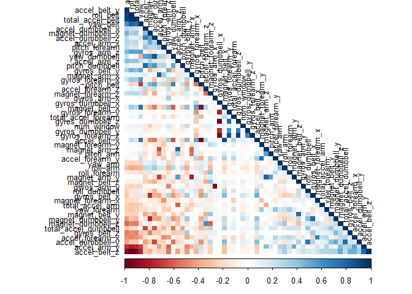
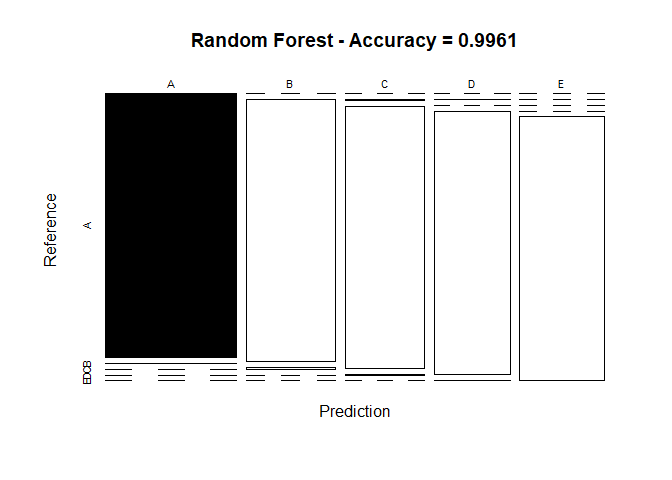
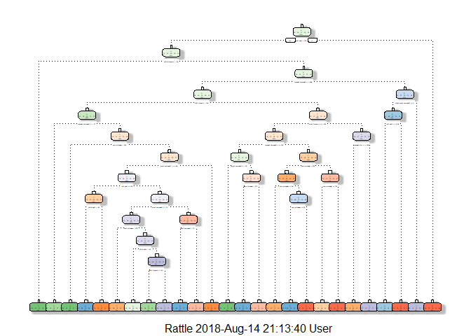
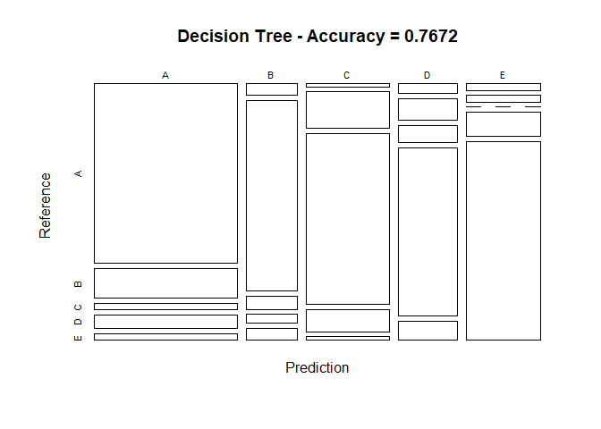
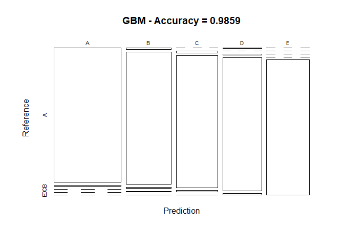

## Introduction

Using devices such as Jawbone Up, Nike FuelBand, and Fitbit it is now possible to collect a large amount of data about personal activity relatively inexpensively. These type of devices are part of the quantified self movement about a group of enthusiasts who take measurements about themselves regularly to improve their health, to find patterns in their behavior, or because they are tech geeks. One thing that people regularly do is quantify how much of a particular activity they do, but they rarely quantify how well they do it. In this project, your goal will be to use data from accelerometers on the belt, forearm, arm, and dumbell of 6 participants. They were asked to perform barbell lifts correctly and incorrectly in 5 different ways. More information is available from the website here: http://groupware.les.inf.puc-rio.br/har (see the section on the Weight Lifting Exercise Dataset).

## Data Source

The training data for this project are available here:

https://d396qusza40orc.cloudfront.net/predmachlearn/pml-training.csv

The test data are available here:

https://d396qusza40orc.cloudfront.net/predmachlearn/pml-testing.csv

## Data Loading and EDA

### a. Environment Setup


```r
library(knitr)
library(caret)
library(rpart)
library(rpart.plot)
library(rattle)
library(randomForest)
library(corrplot)
set.seed(150)
```

### b. Data Loading and Cleaning

The next step is loading the dataset from the URL provided above. The training dataset is then partinioned in 2 to create a Training set (70% of the data) for the modeling process and a Test set (with the remaining 30%) for the validations. The testing dataset is not changed and will only be used for the quiz results generation.


```r
# Download the training data
download.file(url = "https://d396qusza40orc.cloudfront.net/predmachlearn/pml-training.csv", 
              destfile = "./pml-training.csv", method = "curl")

# Load the training dataset
training <- read.csv("./pml-training.csv", na.strings=c("NA","#DIV/0!",""))

# Download the testing data
download.file(url = "https://d396qusza40orc.cloudfront.net/predmachlearn/pml-testing.csv", 
              destfile = "./pml-testing.csv", method = "curl")

# Load the testing dataset
testing <- read.csv("./pml-testing.csv", na.strings=c("NA","#DIV/0!",""))
```


```r
# create a partition using caret with the training dataset on 70,30 ratio
inTrain  <- createDataPartition(training$classe, p=0.7, list=FALSE)
TrainSet <- training[inTrain, ]
TestSet  <- training[-inTrain, ]
dim(TrainSet)
```

```
## [1] 13737   160
```

```r
dim(TestSet)
```

```
## [1] 5885  160
```
Both created datasets have 160 variables. Next, we will clean NA, The Near Zero variance (NZV) variables and the ID variables as well.

```r
# remove variables with Nearly Zero Variance
nzv <- nearZeroVar(TrainSet)
TrainSet <- TrainSet[, -nzv]
TestSet  <- TestSet[, -nzv]
dim(TrainSet)
```

```
## [1] 13737   130
```

```r
dim(TestSet)
```

```
## [1] 5885  130
```

```r
# remove variables that are mostly NA
allna    <- sapply(TrainSet, function(x) mean(is.na(x))) > 0.95 #check this step!
TrainSet <- TrainSet[, allna==FALSE]
TestSet  <- TestSet[, allna==FALSE]

# remove identification only variables (columns 1 to 5)
TrainSet <- TrainSet[, -(1:5)]
TestSet  <- TestSet[, -(1:5)]
dim(TrainSet)
```

```
## [1] 13737    54
```
After cleaning, we can see that the number of variables for the analysis have reduced.

### c. Correlation Analysis (Corrplot)
A correlation among variables is analysed before proceeding to the modeling procedures. The reason is, highly correlated predictors will cause an interaction amongst the regression models and affect the accuracy.


```r
corMatrix <- cor(TrainSet[, -54])
corrplot(corMatrix, order = "FPC", method = "color", type = "lower", 
         tl.cex = 0.8, tl.col = rgb(0, 0, 0))
```

<!-- -->

The highly correlated variables are shown in dark colors in the plot above. To make an even more compact analysis, a PCA (Principal Components Analysis) could be performed as pre-processing step to the datasets. Nevertheless, as the correlations are quite few, this step will not be applied for this assignment.

## Model Development

Three popular methods will be applied to model the regressions (in the Train dataset) and the best one (with higher accuracy when applied to the Test dataset) will be used for the quiz predictions. The methods are: 

* Random Forests
* Decision Tree 
* Generalized Boosted Model

A Confusion Matrix is plotted at the end of each analysis to better visualize the accuracy of the models.

### a. Random Forests


```r
# model fit
set.seed(150)
controlRF <- trainControl(method="cv", number=3, verboseIter=FALSE)
modelrf <- train(classe ~ ., data=TrainSet, method="rf",
                          trControl=controlRF)
modelrf$finalModel
```

```
## 
## Call:
##  randomForest(x = x, y = y, mtry = param$mtry) 
##                Type of random forest: classification
##                      Number of trees: 500
## No. of variables tried at each split: 27
## 
##         OOB estimate of  error rate: 0.28%
## Confusion matrix:
##      A    B    C    D    E  class.error
## A 3904    1    0    0    1 0.0005120328
## B    9 2646    3    0    0 0.0045146727
## C    0    5 2390    1    0 0.0025041736
## D    0    0   10 2241    1 0.0048845471
## E    0    2    0    5 2518 0.0027722772
```

```r
# prediction on Test dataset
predrf <- predict(modelrf, newdata=TestSet)
confMatRandForest <- confusionMatrix(predrf, TestSet$classe)
confMatRandForest
```

```
## Confusion Matrix and Statistics
## 
##           Reference
## Prediction    A    B    C    D    E
##          A 1674    3    0    0    0
##          B    0 1131    9    0    0
##          C    0    4 1017    3    0
##          D    0    1    0  961    3
##          E    0    0    0    0 1079
## 
## Overall Statistics
##                                           
##                Accuracy : 0.9961          
##                  95% CI : (0.9941, 0.9975)
##     No Information Rate : 0.2845          
##     P-Value [Acc > NIR] : < 2.2e-16       
##                                           
##                   Kappa : 0.9951          
##  Mcnemar's Test P-Value : NA              
## 
## Statistics by Class:
## 
##                      Class: A Class: B Class: C Class: D Class: E
## Sensitivity            1.0000   0.9930   0.9912   0.9969   0.9972
## Specificity            0.9993   0.9981   0.9986   0.9992   1.0000
## Pos Pred Value         0.9982   0.9921   0.9932   0.9959   1.0000
## Neg Pred Value         1.0000   0.9983   0.9981   0.9994   0.9994
## Prevalence             0.2845   0.1935   0.1743   0.1638   0.1839
## Detection Rate         0.2845   0.1922   0.1728   0.1633   0.1833
## Detection Prevalence   0.2850   0.1937   0.1740   0.1640   0.1833
## Balanced Accuracy      0.9996   0.9955   0.9949   0.9980   0.9986
```

```r
# plot matrix results
plot(confMatRandForest$table, col = confMatRandForest$byClass, 
     main = paste("Random Forest - Accuracy =",
                  round(confMatRandForest$overall['Accuracy'], 4)))
```

<!-- -->

### b. Decision Tree


```r
# model fit
set.seed(150)
modeldt <- rpart(classe ~ ., data=TrainSet, method="class")
fancyRpartPlot(modeldt)
```

<!-- -->

```r
# prediction on Test dataset
preddt <- predict(modeldt, newdata=TestSet, type="class")
confMatDecTree <- confusionMatrix(preddt, TestSet$classe)
confMatDecTree
```

```
## Confusion Matrix and Statistics
## 
##           Reference
## Prediction    A    B    C    D    E
##          A 1562  259   55  116   60
##          B   34  587   40   26   38
##          C   15  187  870  114   18
##          D   34   77   61  599   69
##          E   29   29    0  109  897
## 
## Overall Statistics
##                                          
##                Accuracy : 0.7672         
##                  95% CI : (0.7562, 0.778)
##     No Information Rate : 0.2845         
##     P-Value [Acc > NIR] : < 2.2e-16      
##                                          
##                   Kappa : 0.7033         
##  Mcnemar's Test P-Value : < 2.2e-16      
## 
## Statistics by Class:
## 
##                      Class: A Class: B Class: C Class: D Class: E
## Sensitivity            0.9331  0.51536   0.8480   0.6214   0.8290
## Specificity            0.8836  0.97092   0.9313   0.9510   0.9652
## Pos Pred Value         0.7612  0.80966   0.7226   0.7131   0.8430
## Neg Pred Value         0.9708  0.89302   0.9667   0.9277   0.9616
## Prevalence             0.2845  0.19354   0.1743   0.1638   0.1839
## Detection Rate         0.2654  0.09975   0.1478   0.1018   0.1524
## Detection Prevalence   0.3487  0.12319   0.2046   0.1427   0.1808
## Balanced Accuracy      0.9084  0.74314   0.8896   0.7862   0.8971
```

```r
# plot matrix results
plot(confMatDecTree$table, col = confMatDecTree$byClass, 
     main = paste("Decision Tree - Accuracy =",
                  round(confMatDecTree$overall['Accuracy'], 4)))
```

<!-- -->

### c. Generalized Boosted Model (GBM)


```r
# model fit
set.seed(150)
controlGBM <- trainControl(method = "repeatedcv", number = 5, repeats = 1)
modelgbm  <- train(classe ~ ., data=TrainSet, method = "gbm",
                    trControl = controlGBM, verbose = FALSE)
modelgbm$finalModel
```

```
## A gradient boosted model with multinomial loss function.
## 150 iterations were performed.
## There were 53 predictors of which 42 had non-zero influence.
```

```r
# prediction on Test dataset
predgbm <- predict(modelgbm, newdata=TestSet)
confMatGBM <- confusionMatrix(predgbm, TestSet$classe)
confMatGBM
```

```
## Confusion Matrix and Statistics
## 
##           Reference
## Prediction    A    B    C    D    E
##          A 1663   13    0    0    0
##          B   10 1112    7    7    2
##          C    0   14 1014   10    3
##          D    1    0    5  947   11
##          E    0    0    0    0 1066
## 
## Overall Statistics
##                                           
##                Accuracy : 0.9859          
##                  95% CI : (0.9825, 0.9888)
##     No Information Rate : 0.2845          
##     P-Value [Acc > NIR] : < 2.2e-16       
##                                           
##                   Kappa : 0.9822          
##  Mcnemar's Test P-Value : NA              
## 
## Statistics by Class:
## 
##                      Class: A Class: B Class: C Class: D Class: E
## Sensitivity            0.9934   0.9763   0.9883   0.9824   0.9852
## Specificity            0.9969   0.9945   0.9944   0.9965   1.0000
## Pos Pred Value         0.9922   0.9772   0.9741   0.9824   1.0000
## Neg Pred Value         0.9974   0.9943   0.9975   0.9965   0.9967
## Prevalence             0.2845   0.1935   0.1743   0.1638   0.1839
## Detection Rate         0.2826   0.1890   0.1723   0.1609   0.1811
## Detection Prevalence   0.2848   0.1934   0.1769   0.1638   0.1811
## Balanced Accuracy      0.9952   0.9854   0.9914   0.9895   0.9926
```

```r
# plot matrix results
plot(confMatGBM$table, col = confMatGBM$byClass, 
     main = paste("GBM - Accuracy =", round(confMatGBM$overall['Accuracy'], 4)))
```

<!-- -->

## Using the Best Model for Testing

The accuracy of the 3 regression modeling methods above are:

Random Forest : 0.9961 Decision Tree : 0.7672 GBM : 0.9859 In that case, the Random Forest model will be applied to predict the 20 quiz results (testing dataset) as shown below.


```r
predtest <- predict(modelrf, newdata=testing)
predtest
```

```
##  [1] B A B A A E D B A A B C B A E E A B B B
## Levels: A B C D E
```
